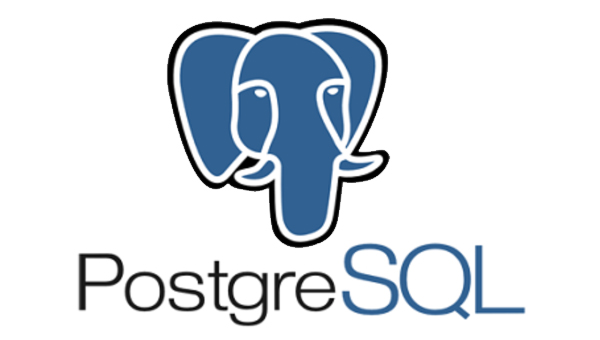

# **Proyecto Final Data Science - Sismos**

## **Indice**

- [Introducción](#introducción)
- [Planteamiento de trabajo](#planteamiento-de-trabajo)
- [Objetivos generales](#objetivos-generales)
- [Enfoque de trabajo](#enfoque-de-trabajo)
- [Stack tecnológico](#stack-tecnológico)
- [Flujo de trabajo](#flujo-de-trabajo)
- [Alcance del proyecto](#alcance-del-proyecto)
- [KPIs](#kpis)

## **Introducción**

Somos Evil Corp una consultora en gestion de desastres (CGD) en alianza con INDECI Instituto Nacional de Defensa de Perú, United States Geological Survey (USGS) y la Agencia Meteorológica de Japón (JMA). Estamos trabajando en un proyecto tri-nacional. Los objetivos de esta alianza son dos:

En primer lugar, buscamos crear una base de datos depurada que contemple los datos de las tres naciones de forma estandarizada. Es de suma importancia contar con información estándar de todos los países involucrados para poder desarrollar un mecanismo de clasificación confiable.

En segundo lugar, nos enfocaremos en implementar mecanismos de comunicación y alerta en las comunidades rurales. Es fundamental que el público pueda recibir información clara y comprensible sobre la ocurrencia de sismos y cualquier situación que represente un riesgo para la salud y la seguridad.

El enfoque principal de nuestro proyecto será implementar un sistema de alerta sísmica en las zonas rurales de Perú, ya que estas áreas suelen contar con una infraestructura de comunicación limitada, lo que las expone a un mayor riesgo en caso de sismos.

## **Planteamiento de trabajo**

El análisis de datos desempeña un papel clave en la comprensión de los sismos para la identificación de patrones y tendencias que pueden ayudar a clasificar estos fenómenos e identificar las zonas de mayor riesgo. Además, es fundamental para desarrollar estrategias de prevención y mitigación de riesgos más efectivas. A su vez poder comprender mejor la magnitud de los desastres naturales y sus efectos en la sociedad.

En el marco del proyecto tri-nacional "Working towards global standardization of seismological networks and effective communication to the civilian community", en el cual formaremos parte del equipo de atención de desastres, nos enfrentamos a un desafío fundamental.

El primer objetivo de esta alianza es crear una base de datos estandarizada que es de suma importancia para las autoridades, ya que les permitirá contar con información uniforme y confiable de todos los países involucrados. Asimismo, se debe definir claramente qué se considera un evento sísmico y establecer criterios de alerta adecuados, teniendo en cuenta la calidad de los datos.

Por otro lado, el segundo objetivo de la alianza es implementar mecanismos de comunicación y alerta a la comunidad civil en un lenguaje intuitivamente interpretable a través de Internet o cellBroadcast. Por lo tanto, es necesario establecer canales de comunicación claros y accesibles para transmitir esta información de manera efectiva.

Buscamos fortalecer la capacidad de respuesta ante desastres y mejorar la comunicación con la comunidad civil en caso de eventos sísmicos. Al estandarizar los datos sismológicos e implementar mecanismos de alerta efectivos, estaremos contribuyendo a la seguridad y protección de las comunidades más afectadas

## **Objetivos generales**

- Analizar las consecuencias inmediatas de los terremotos en el territorio peruano, considerando su impacto en la población, las estructuras y la posibilidad de réplicas o tsunamis.

- Establecer una base de datos normalizada que integre información sísmica de Japón, Estados Unidos y Perú.

- Desarrollar un modelo de clasifiación utilizando la base de datos mencionada anteriormente, con el fin de clasificar los terremotos según su nivel de peligrosidad.

- Crear un dashboard interactivo que muestre visualmente el análisis realizado, permitiendo explorar los datos recopilados y los obtener los KPIs.

- Desarrollar un sistema de alerta sísmica para las zonas rurales de Perú, que no solo advierta sobre la ocurrencia de terremotos, sino que también proporcione recomendaciones claras y prácticas para que la población actúe de manera adecuada frente a estos eventos, incluyendo información relevante sobre réplicas.

## **Enfoque de trabajo**

Para abordar este proyecto, proponemos trabajar con dos enfoques: Enfoque 1, centrado en el análisis de datos, y Enfoque 2, enfocado en el uso de machine learning. A continuación, se detallan los enfoques de trabajo propuestos:

Análisis de datos

- Extracción de datos.

- Proceso de transformación.

- Análisis de la data

- KPIs del proyecto

Machine Learning

En esta parte implementaremos un sistema de alerta sísmica en las zonas rurales de Perú, ya que estas áreas suelen contar con una infraestructura de comunicación limitada, lo que las expone a un mayor riesgo en caso de sismos.

## **Stack tecnológico**

   

## **Flujo de trabajo**

La data ingestada se tratará con Python y Pandas donde se hará un ETL y un EDA, después esta se exportará en archivos CSV que mediante Python y SQLAlchemy se subirá a una base de datos PostgreSQL que vivirá en la nube de GCP (Google Cloud Platform), así mismo la data en tiempo real se subirá desde la web del Instituto Geofísico del Perú (IGP), toda esta base de datos será consumida posteriormente en un dashboard de PowerBI y también en el modelo de Machine Learning.

## **Alcance del proyecto**

Evil Corp, consultora en gestión de desastres (CGD) ha estado colaborando con INDECI para estandarizar las redes sismológicas y mejorar la comunicación con la comunidad civil.

Este proyecto abarcará tres países ubicados en el anillo de fuego. Nuestro objetivo es realizar un estudio sobre el daño potencial causado por los movimientos sísmicos en el área circundante. Para calcular este daño, utilizaremos un modelo entrenado con datos de Estados Unidos, Japón y Perú. Inicialmente, probaremos este modelo utilizando datos sísmicos de Perú y posteriormente lo implementaremos en los otros dos países del convenio.

Al desarrollar este sistema de alerta sísmica, hemos dado especial importancia a la claridad y precisión de la información proporcionada a la población rural. Reconocemos que, en situaciones de emergencia, una comunicación efectiva y oportuna puede marcar la diferencia entre la vida y la muerte.

## **KPIs**

- KPI: Índice de déficit por desastre:
  El objetivo de este KPI es calcular los daños económicos y los costos en las zonas rurales más afectadas por los terremotos. Para medir este indicador, realizaremos un análisis exhaustivo de los impactos económicos, incluyendo la evaluación de la infraestructura dañada y otros factores relevantes.

- KPI: Vidas salvadas
  El objetivo de este KPI es cuantificar cuántas vidas se pueden salvar mediante las implementaciones de nuestro sistema de alerta. Utilizaremos análisis estadísticos para evaluar el impacto de las acciones implementadas en la reducción de la mortalidad relacionada con los sismos. Consideraremos factores como la mejora de las alertas tempranas. Nuestro objetivo es determinar el número estimado de vidas que se pueden salvar como resultado de estas medidas y utilizar esta información para evaluar y mejorar continuamente nuestras estrategias.

- KPI: Tiempo de respuesta del sistema de alarma:
  El objetivo de este KPI es medir el tiempo que lleva a nuestro sistema de alarma detectar y notificar un sismo a la comunidad. Implementaremos un sistema de monitoreo sísmico en tiempo real y estableceremos métricas para evaluar la rapidez y eficiencia con la que se emiten las alertas. Consideraremos el tiempo transcurrido desde la detección del sismo hasta el envío de los mensajes de texto a las zonas afectadas. Nuestro objetivo es minimizar este tiempo de respuesta para brindar a las personas el máximo tiempo posible para tomar medidas de seguridad.

- KPI: Rating o nivel de satisfacción por parte de la comunidad:
  El objetivo de este KPI es evaluar el nivel de satisfacción y percepción de la comunidad en relación con nuestras acciones y comunicaciones durante y después de un evento sísmico. Implementaremos mecanismos para recolectar retroalimentación de las personas afectadas, ya sea a través de encuestas, entrevistas o canales de comunicación directa. Analizaremos los datos recopilados y asignaremos una calificación o rating que refleje el nivel de satisfacción general. Este KPI nos permitirá evaluar y mejorar continuamente nuestros servicios y la efectividad de nuestras estrategias de comunicación.

- KPI: Alcance de la información según la magnitud del sismo:
  El objetivo de este KPI es cuantificar cuántas personas pueden acceder y recibir la información sobre un sismo en función de su magnitud. Estableceremos criterios para clasificar la magnitud de los sismos y analizaremos la capacidad de nuestro sistema de comunicación para llegar a diferentes segmentos de la población. Utilizaremos datos demográficos y de conectividad para estimar el alcance de nuestra información en cada caso. Este KPI nos permitirá evaluar la efectividad de nuestra comunicación y determinar si es necesario ajustar nuestros canales o estrategias para llegar a un público más

### **Integrantes**

- Clara Camilo (Machine Learning Engineer)
- Esteban Santillán (Data Analytics)
- Estefanía Serna (Data Analytics)
- Hugo Gómez (Data Engineer)
- Oscar Arias (Data Engineer)
