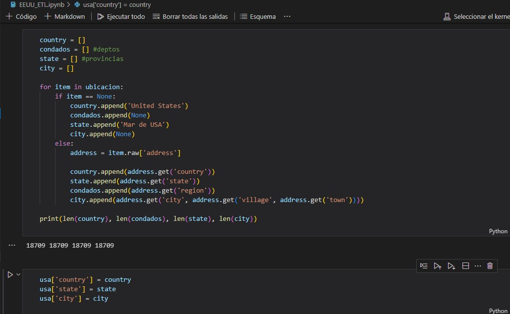
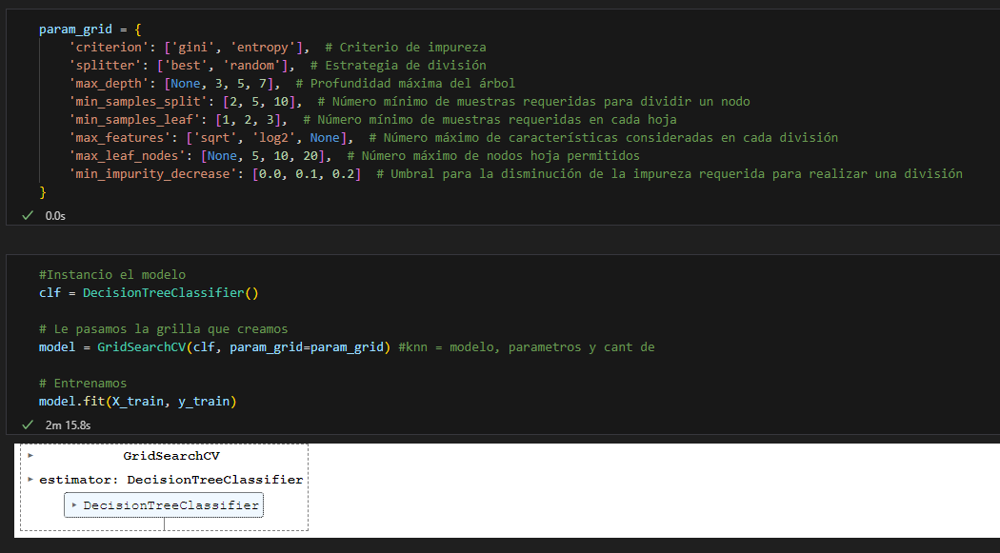
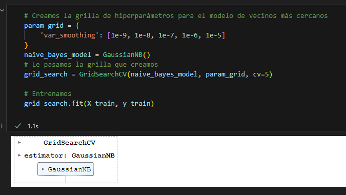

# **DOCUMENTACIÓN**

Se verá la principal transformación de datos (ETL) y las columnas de datos que serán extraídas, y también la explicación del modelo de _Machine Learning_ terminado.

Para correr todo el proyecto sin inconvenientes se recomienda crear un entorno virtual e instalar los requirements que son todas las librerias que se van a utilizar.

## EE.UU ETL

Este código recibe una longitud y una latitud y nos devuelve la ubicacion del lugar con su pais, su estado.

Luego se crea una nueva columna "coordenadas", que contiene las coordenadas combinadas de latitud y longitud para cada fila, utilizando la función combinar_coordenadas y se guardan en una lista.

Con un ciclo se recorre la lista de coordenadas para cada una de ellas. La lista ubicacion contendrá los resultados de la geolocalización inversa correspondientes a cada coordenada en coordenadas (longitud y latitud)

Ahora se procesa la lista de ubicaciones obtenidas previamente y se realiza la geolocalización inversa para cada ubicación y extrae información como el país, el estado, el condado y la ciudad.

Luego, con la funcion "unique" tomamos solo los valores unicos de la columna "city", "state" y "country".

Despues se modifica la columna "time" para tener hora y fecha por separado.

Apreciendo los datos faltantes se decidio rellenar valores con la media de las columnas para que los datos tengan mayor coherencia.

Se exporta el CSV.

## PERU ETL

Este código recibe una longitud y una latitud y nos devuelve la ubicacion del lugar con su pais, su estado.

Luego, como en el caso del ETL de EE.UU se crea una nueva columna "coordenadas", que contiene las coordenadas combinadas de latitud y longitud para cada fila, utilizando la función combinar_coordenadas y se guardan en una lista.

Despues se realiza una funcion para extraer información sobre el país, departamento, provincia y ciudad de cada ubicación con la longitud y latitud.

Se exporta el CSV.

## JAPON ETL

A cada elemento de la columna 'Epicentro'. La función lambda elimina los caracteres que no necesitamos de cada valor en la columna.

Se crea una función para localizar "estados" se utiliza para asignar un estado o prefectura de Japón basado en los valores de una fila. Se busca encontrar una coincidencia de nombres de prefecturas de Japón en las filas.

Luego, se renombrar columnas y se borraran algunas de poca relevancia.

Se exportan el CSV

## ETL Daños

Revisamos el dataset y eliminamos columnas que no se usaran.

Se cambia el formato de fecha y se restablece el indice.

Ahora, calculamos las sumas de las columnas que nos interesan para calcular los enfocadas en la informacion de daños.

Despues revisamos las columnas 'AFECT', 'DAMNIF' y calculamos el mayor maximo entre estas columnas, esto con el fin de tener una fila especifica con el numero maximo de afectados y damnificados.

Renombramos algunas columnas.

Agregamos la nueva columna id_danio para agregar un Id unico a cada fila y se pueda relacionar con otras tablas.

Luego, reorganizamos las columnas en un orden especifico. Empezando por el id_danio.

Unimos los datasets por "fecha" y "estado".

## ETL Final

Revisamos los datasets y eliminamos la columna ciudad de la data de Peru.

Concatenamos los datsets para trabajar mas comodamente con los datos.

Insertamos la columna id_sismo para tener un identificar unico en cada fila.

Se eliminan filas duplicadas en las columnas pais y estado y se reinician los indices para estas columnas. Se crea un nuevo dataframe id_lugar para tener una identificacion unica de cada ubicacion.

Borramos algunas columnas que no necesitamos y exportamos los csv sismos_completo y lugar.

## Machine Learning

En esta primera parte se busca generar una clasificación para los terremotos, separándolos en 3 niveles de peligrosidad. Para ello, se utilizan los datos de los daños generados por los sismos, los cuales están separados por los estados a los cuales afectaron.

Se realiza la **prueba 1** generando tres clusters que creen la división de peligrosidad solo con los daños.

Se descarta por generar un cluster que contiene la mayoría de los valores.

Se genera la primera fórmula de peligrosidad asignándole un valor a multiplicar para cada columna, teniendo en cuenta su nivel de importancia. Se generan nuevamente clusters para probar si hubo alguna modificación.

Se realiza la **prueba 2** agregando los datos sobre la magnitud y la profundidad de cada sismo, generando nuevamente tres clusters.

Se agrega la fórmula de peligrosidad y se prueba nuevamente la clusterización.

Se pasa a la **prueba 3**, en la cual se agrupan los registros por sismos sumando los daños de cada estado, luego se realiza un merge de los datasets para agregar la profundidad y la magnitud de cada sismo.

Se genera la fórmula con algunos ajustes y se agrega la columna "totales" con la suma de los valores correspondientes. Luego, se genera la clasificación en tres niveles de peligrosidad (1, 2, 3) basados en los datos observados.

Se definen las variables independientes (X) y la variable objetivo (y).

#### Modelos de clasificación

Comienzan las pruebas de modelos de clasificación con sus respectivos ajustes para mejorar los hiperparámetros y lograr el mejor valor de accuracy.

En las imágenes siguientes podremos ver los modelos ya con los mejores hiperparámetros y los valores de accuracy máximos logrados.

##### Decision Tree Classifier

Mejora de hiperparámetros con Grid Search

Mejores hiperparámetros  
{'criterion': 'gini', 'max_depth': 7, 'max_features': 'log2', 'max_leaf_nodes': None, 'min_impurity_decrease': 0.0, 'min_samples_leaf': 3, 'min_samples_split': 2, 'splitter': 'random'}  
Mejor Score: 0.7121794871794872

##### K- Neighbors Classifier

Mejora de hiperparámetros con Grid Search

Mejores hiperparámetros  
{'algorithm': 'auto', 'leaf_size': 1, 'metric': 'minkowski', 'n_neighbors': 8, 'p': 2, 'weights': 'uniform'}  
Mejor Score: 0.696923076923077

##### SVM

##### Random Forest Classifier

Mejora de hiperparámetros con Grid Search

Mejores hiperparámetros  
{'max_depth': 5, 'max_features': 'sqrt', 'min_samples_leaf': 1, 'min_samples_split': 5, 'n_estimators': 200}  
Mejor Score: 0.6815384615384616

### Modelo a utilizar

#### Naive Bayes

Mejora de hiperparámetros con Grid Search

Mejores hiperparámetros: {'var_smoothing': 1e-05} 
Mejor Score: 0.7017948717948718

## Diccionario de datos

- Profundidad: Si el terremoto es poco profundo, el temblor será intenso. Si el terremoto es profundo, las ondas sísmicas se debilitan en su camino hacia la superficie.

- Magnitud: Tamaño de un sismo y la energía sísmica liberada.

- Epicentro: El punto de origen.

- Fecha UTC: Tiempo Universal Coordinado.

- Altura_ola: Es la altura maxima de la ola del tsunami.

- Viv_destr: Cantidad de viviendas destruidas.

- Viv_afect: Cantidad de viviendas afectadas.
